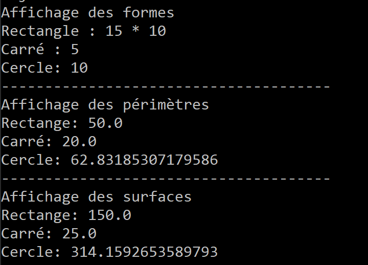

<h1>Second Java's project to explain Inheritance concept</h1>

In this practical work, let's not try to highlight the notions of inheritance as well as the complementary notions such as:

<b>
<ul>
    <li>Interfaces</li>
    <li>Redefinition</li>
    <li>Overload</li>
    <li>Abstract classes and methods</li>
    <li>Polymorphism</li>
</ul>
</b>

To dowload this project, we have to open your git bash command prompt and enter this command:

<code>git clone https://github.com/JuniorSIEMBE/Projet2Java.git</code>

To run the code you have two options:
<ol>
    <li>Use an EDI like Eclipse, IntellIJ and so one and run this code</li>
    <li>Use a command prompt and enter the following command: 
    <ol>
        <li><code>javac -d target\classes src\cm\ime\projet\api\Forme.java</code></li>
        <li><code>javac -d target\classes src\cm\ime\projet\api\Rectangle.java</code></li>
        <li><code>javac -d target\classes src\cm\ime\projet\api\Cercle.java</code></li>
        <li><code>javac -d target\classes src\cm\ime\projet\api\Carre.java</code></li>
        <li><code>javac -d target\classes src\cm\ime\projet\test\TestFrome.java</code></li>
        <li><code>java -cp target\classes cm.ime.projet.test.TestForme</code></li>
    </ol>
    </li>
</ol>

After running, you are suppose to get this result:

</img>
<h3>Thank you and good luck!</h3>